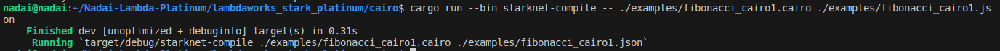
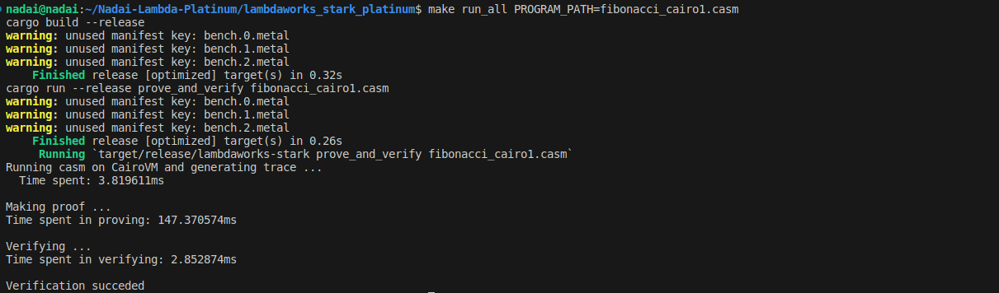

<div align="center">
  
  <h1 style="font-size: larger;">
    
    <strong>Guía Lambdaworks STARKs Prover Platinum</strong>
    
  </h1>

<a href="https://github.com/lambdaclass">

</a>
<a href="https://github.com/lambdaclass/lambdaworks_stark_platinum">

</a>
</a>
<a href="https://twitter.com/starknet_devs">

</a>
<a href="https://twitter.com/Nadai02010">

</a>
<a href="https://github.com/lambdaclass/lambdaworks_stark_platinum">

</a>
</div>

## Índice

- [Introducción](#introducción)
- [Requisitos](#requisitos)
- [Instalación](#instalación)
- [Compilación y Ejecución](#compilación-y-ejecución)
- [Comandos Rápidos](#comandos-rápidos)
- [Conclusiones](#conclusiones)
- [Recursos Adicionales](#recursos-adicionales)

## Introducción

Bienvenido a la Guía en español de Lambdaworks STARKs Prover Platinum. En esta guía, aprenderás cómo instalar el Lambdaworks STARKs Prover Platinum, una herramienta en desarrollo para demostrar la validez de ciertos programas escritos en el lenguaje Cairo.

### Requisitos

Antes de empezar, asegúrate de tener instalado **Cargo 1.69** o una versión posterior.

## Instalación

Para empezar, clona el repositorio del Lambdaworks STARKs Prover Platinum en tu máquina local, puede clonar la repo oficial:

* Por Github CLI
```bash
gh repo clone lambdaclass/lambdaworks_stark_platinum
```

* Por SSH
```bash
git clone git@github.com:lambdaclass/lambdaworks_stark_platinum.git
```

También puede clonar este repositorio en el que ya tendrá las archivos en `CASM` y `JSON`.

* 

<div align="left">

</div>

## Compilación y Ejecución

Una vez que hayas clonado el repositorio, si deseas utilizar programas Cairo (Cairo 1) en lugar de Cairo 0, deberás clonar la librería de Cairo y añadir la versión compatible en este momento `v1.1.0`. Para ello, primero clonamos:

```bash
git clone https://github.com/starkware-libs/cairo
```

Luego iremos a la carpeta de Cairo que acabamos de clonar ejecutando:

```bash
git checkout v1.1.0
```
<div align="left">

</div>

Ahora debes convertir el programa Cairo en un archivo `JSON` usando el comando `starknet-compile`, y luego en `CASM` usando el comando `starknet-sierra-compile`. A continuación, se muestra el procedimiento:

```bash
cargo run --bin starknet-compile -- ./examples/fibonacci_cairo1.cairo ./examples/fibonacci_cairo1.json
```

```bash
cargo run --bin starknet-sierra-compile -- ./examples/fibonacci_cairo1.json ./examples/fibonacci_cairo1.casm
```

<div align="left">

</div>

<div align="left">

</div>

Luego puedes probar el prover y el verificador usando el comando `make prove` y `make verify`, respectivamente. Asegúrate de especificar la ruta correcta del programa Cairo que deseas probar o verificar y la ruta de salida, en nuestro caso movimos el archivo `CASM` a la raíz del proyecto y ejecutamos:

```bash
make prove PROGRAM_PATH=fibonacci_cairo1.casm PROOF_PATH=fibonacci_proof
make verify PROOF_PATH=fibonacci_proof
```

<div align="left">

</div>

## Comandos Rápidos

Si deseas ejecutar todos los pasos anteriores en un solo comando, puedes usar el siguiente comando rápido:

```bash
make run_all PROGRAM_PATH=fibonacci_cairo1.cairo
```

<div align="left">

</div>


## Conclusiones

En esta guía, has aprendido cómo utilizar el Lambdaworks STARKs Prover Platinum para probar y verificar programas escritos en Cairo. Recuerda que esta herramienta aún está en desarrollo y puede contener errores. Si encuentras algún problema, no dudes en revisar las issues o esperar a que se resuelvan antes de utilizarla en un entorno de producción.

Esperamos que esta guía te haya sido útil y te ayude a explorar el emocionante mundo de los STARKs y la demostración de la validez de programas en Cairo. ¡Diviértete probando y verificando tus programas!

## Recursos Adicionales

- [GitHub - Lambdaworks STARKs Prover Platinum](https://github.com/lambdaclass/lambdaworks_stark_platinum)
- [Libro TEST Lambdaworks STARKs Prover Platinum](https://lambdaclass.github.io/lambdaworks_stark_platinum/)
